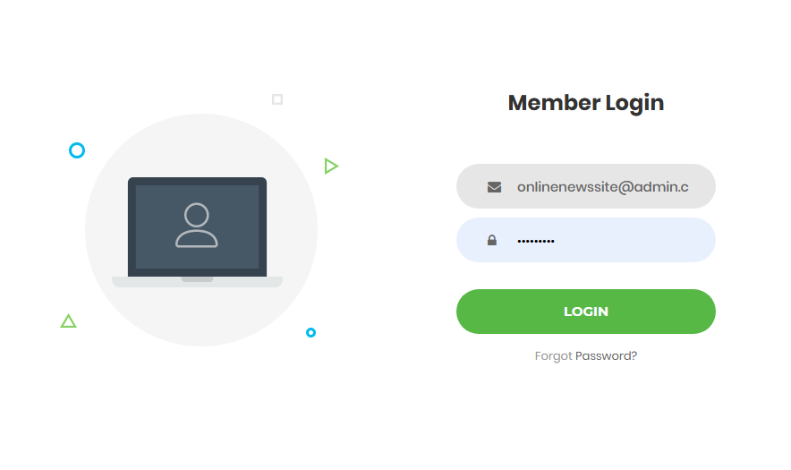
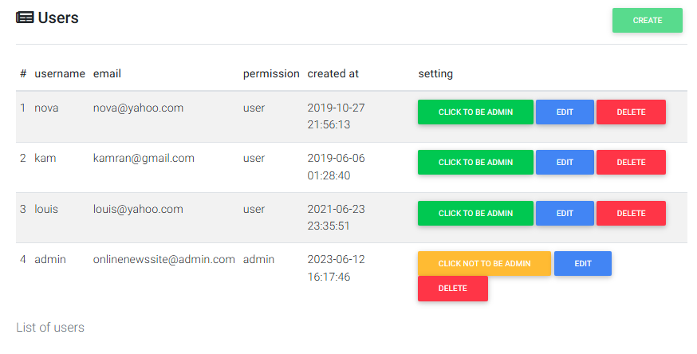
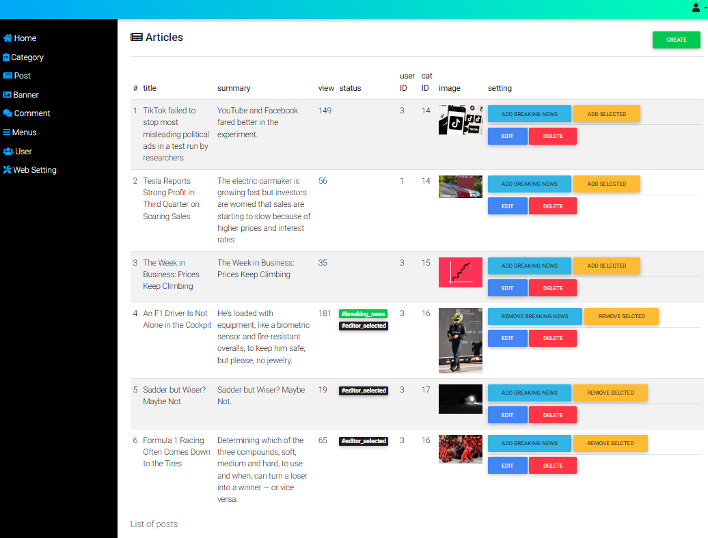
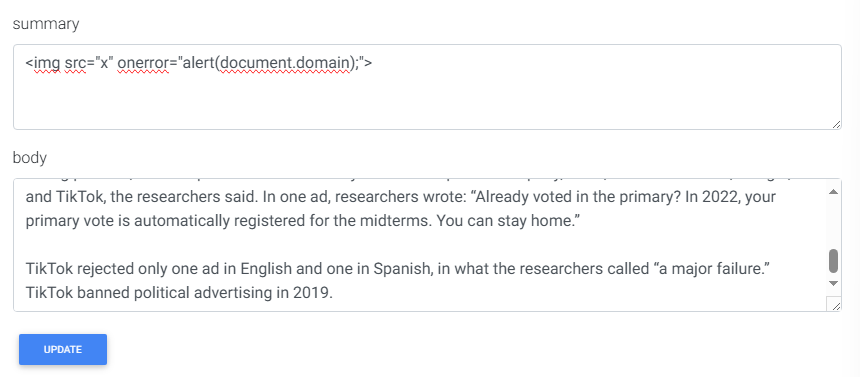

# Exploit Report: MobinaJafarian/OnlineNewsSite v 1.0 - stored Cross Site Scripting (XSS) vulnerability.

- **Exploit Title:** OnlineNewsSite v 1.0 - stored Cross-Site Scripting vulnerability
- **Date:** 24-08-2024
- **Exploit Author:** Aslam Anwar Mahimkar
- **Vendor Homepage:** [MobinaJafarian/OnlineNewsSite](https://github.com/MobinaJafarian/OnlineNewsSite)
- **Software Link:** [LOnlineNewsSite v 1.0](https://github.com/MobinaJafarian/OnlineNewsSite.git)
- **Version:** 1.0
- **Tested On:** Windows
- **CVE:** CVE-2024-45933

## Description

A stored cross-site scripting (XSS) vulnerability exists in MobinaJafarian/OnlineNewsSite v 1.0 that can allows a low-privilege user to create malicious post content with HTML inside it, which acts as a stored XSS payload. If this post page is visited by anyone including the administrator, then the XSS payload will be triggered.
## Affected Endpoint:

`/OnlineNewsSite/admin/post/edit/11 (Title and summary filed)`

# Steps to Exploit XSS Vulnerability

## 1. Login as an Admin with given user credentials
You can log in using the default low-privilege user and then create or edit a post with the XSS payload.



## 2. Check Default Users
There are some default users already created.



## 3. Create or Edit a Post Owned by a User
You can edit one of the posts owned by a user. In this example, we will use the default post owned by user ID 1.



## 4. Add XSS Payload to Title and Summary
Insert the XSS payload into the Title and Summary fields.

**Payload:**
```html

```




## 5. After UPDATE the post content, go to the page and see the XSS is triggered. In this case I use administrator account to trigger the XSS.

